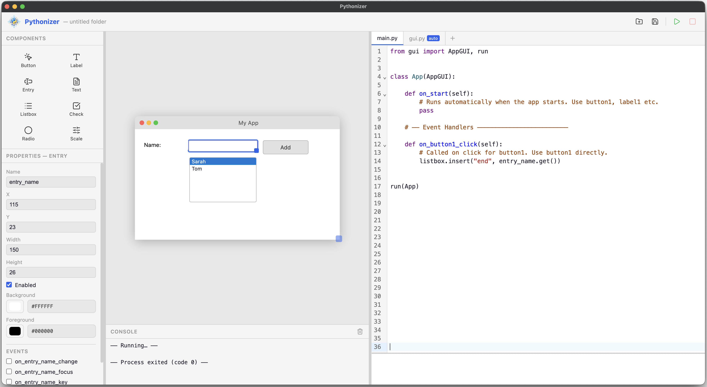

# Pythonizer

<p align="center">
  
</p>

<p align="center">
  A visual <code>tkinter</code> builder designed for teaching.
  Students can assemble a GUI, inspect the generated Python structure, and keep their application logic separate from the auto-generated UI code.
</p>

<p align="center">
  <a href="https://github.com/dren413/Pythonizer/releases">Downloads</a>
  ·
  <a href="https://github.com/dren413/Pythonizer/releases/latest">Latest Release</a>
</p>

---

Pythonizer was created from a teacher perspective to fill a gap in pedagogical tools. It makes GUI building faster, but the point is not just speed. The goal is to help learners understand how a desktop interface maps to readable `tkinter` code.

Instead of hiding the code behind a purely visual editor, Pythonizer keeps the generated interface structure visible and predictable. That makes it useful for classroom demos, beginner projects, and assignments where students should learn both GUI design and program structure.

## Why Pythonizer?

- Build a `tkinter` interface visually with drag-and-drop components.
- Keep generated UI code separate from the logic students actually edit.
- Let learners inspect how widgets, layout, and events map into Python files.
- Run projects quickly from inside the app.
- Use a simpler, focused component set that is easier to teach.

## What It Does

Pythonizer currently focuses on a small, classroom-friendly widget set:

- `Button`
- `Label`
- `Entry`
- `Text`
- `Listbox`
- `Checkbutton`
- `Radiobutton`
- `Scale`

The app includes:

- a design canvas for placing widgets
- a properties panel for editing widget settings
- code generation for `gui.py`
- a separate `main.py` for application logic
- support for additional Python files in the same project
- built-in run support
- light and dark themes
- code editor zoom controls for teaching and projection use

## Screenshot



## How The Project Structure Works

Pythonizer keeps the generated UI separate so students can focus on program logic:

```text
my_project/
|- project.json   # widget layout and window settings
|- gui.py         # fully auto-generated tkinter UI class
`- main.py        # entry point for handlers and app logic
```

In practice, `main.py` is the file learners usually work in. `gui.py` is regenerated from the canvas, while `project.json` stores the editor state. Extra Python files can be added when a project grows.

## Who It Is For

- teachers introducing GUI programming with Python
- students learning event-driven programming
- beginners who benefit from seeing generated code instead of abstract builders
- classrooms that need fast demos and small practice projects

## Downloads

Prebuilt desktop releases are published on GitHub:

- Windows installer / executable: see [Releases](https://github.com/dren413/Pythonizer/releases)
- macOS DMG: see [Releases](https://github.com/dren413/Pythonizer/releases)

If a local Python interpreter is needed on a machine, Pythonizer can be pointed to it from inside the app.

## Local Development

Pythonizer now runs as a Tauri application with a React frontend.

### Requirements

- Node.js
- Rust toolchain
- a Python installation with `tkinter` available for running generated apps

### Run In Development

```bash
npm install
npm run dev
```

### Build

```bash
npm run build
```

## Project Status

Pythonizer is actively evolving. The current focus is on a clean teaching workflow, reliable desktop packaging, and making the generated code easier for students to understand.

## License

No license file is currently included in this repository.
